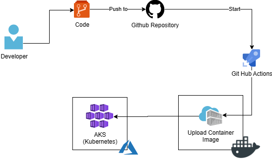

# Techchallenge05 - Deploy de dois microserviços no AKS  com github actions

Tech Challenge 05 consta na elaboração do arquivo dockerfile de dois microsserviço (BasketApi e OrderingApi) de um E-Commerce, fazendo a publicação das novas imagens no Docker hub. Além disso, é feito o deploy da aplicação no AKS do Azure através do uso do github actions.
Para realização do desafio proposto, foi realizada a criação de dois microserviços Basket e Ordering connectados por um broker RabbitMQ para produzir e consumir eventos gerados entre os microserviços.
Abaixo é possível verificar a arquitetura da Applicação por completa:


Foi criada uma biblioteca chamada EventBus.Messages que prove a comunicação entre o microsserviço de Basket e Ordering.

A Implementação do Barramento de dados com RabbitMQ e Masstransit, na qual, os microserviços publicam eventos e recebem eventos é exibido na imagem abaixo:


A API Ordering foi feita utilizando EntityFramework com SQL Server aplicando arquitetura limpa e CQRS com mediator.
Já a API Basket foi feita utilizando EntityFramework com REDIS.

Funciomento:

1.  Usuário adiciona os itens no carrinho através do endpoid POST Basket e são guardados no banco de dados redis.
2.  Após adicionar todos os itens no carrinho, é enviado o comando de BasketCheckout atráves do end point `[POST] api/v1/Basket/Checkout` pela aplicação do cliente.
3.  O microserviço Basket recebe a informação e começa a tratar o dados como remover os itens da cesta do redis e envia-lo para o broker.
4.  É feita a publicação do evento BaketCheckout para o RabbitMQ utilizando o MassTransit.
5.  Os microserviços subescritos para receber esse evento, no caso, o microserviço Ordering, irá receber e consumir o evento para criar o pedido e salvar no banco de dados SQL.


## CI/CD

Esse projeto possui um pipeline de integração e entrega continua (CI/CD) com github action , de modo de automatizar o processo. O fluxo desse processo pode ser visto na imagem abaixo:



1. O desenvolvedor faz um push para o repositório do github na branch master.
2. O pipeline do GitHub Actions é iniciado.
3. Inicia-se o processo de criação das imagens para cada um dos microserviços a partir do dockerfile correspontende.
4. Após a conclusão de build da imagem, a mesma é carregada no Dockerhub.
5. Com as novas imagens no Docker Hub, é feito o deploy da nossa solução completa em um cluste kubernetes, na qual, foi utilziado o AKS do azure. O arquivo de deploy do kubernetes utilizado pode ser encontrado na pasta `/src/k8s/deployment.yaml`.
6. Cluster kubernetes atualizado e aplicação disponibilizada para o usuário.

## Aplicação

O Projeto não possue front end, sendo assim, foi disponibilizado somente os endpoint para comunicação através de alguma ferramente de mercado que faça requisições HTTP ou swagger.
Para fazer o o comando de checkout é necessário antes ter adicionado pelo menos um item na cesta.

### URL de Acesso

Para testar a API é necessário criart todo infraestrutura antes. As URLS de acesso será da seguiinte forma:

1. URL `https://<AKS_DNS_SERVICE>:<PORT>/swagger/index.html` para acesso via Swagger.

### Métodos

Requisições para a API devem seguir os padrões:
| Método | Descrição |
|---|---|
| `GET` | Retorna informações de um ou mais registros. |
| `POST` | Utilizado para criar um novo registro. |
| `PUT` | Atualiza dados de um registro ou altera sua situação. |
| `DELETE` | Remove um registro do sistema. |

### Respostas

| Código | Descrição                                                          |
| ------ | ------------------------------------------------------------------ |
| `200`  | Requisição executada com sucesso (success).                        |
| `400`  | Erros de validação ou os campos informados não existem no sistema. |
| `401`  | Usuário não autorizado.                                            |
| `500`  | EndPoint não encontrado,                                           |

### Controller [/Basket]

Reponsável pelo controle da cesta do E-commerce. Nele é onde será feito o controle da cesta do usuário como adição de itens e checkout.
OBS:Para fazer o o comando de checkoput é necessário antes ter adicionado pelo menos um item na cesta.

| Método   | URL                         | Descrição                  | Parâmetros [JSON]     | Retorno        |
| -------- | --------------------------- | -------------------------- | --------------------- | -------------- |
| `POST`   | [api/v1/Basket]             | Adiciona item na cesta     | Lista de itens        | -------------- |
| `GET`    | [api/v1/Basket/{username}]  | Retorna os itens da cesta  | --------------------- | Lista de itens |
| `DELETE` | [api/v1/Basket/{username}`] | Deleta os itens da cesta.  | --------------------- | -------------- |
| `POST`   | [api/v1/Basket/Checkout]    | checkout do itens da cesta | basket checkout itens | -------------- |

### Controller [/Order]

Responsável pelo controle de artigos da API. Esse endpoint deve ser utilizado somente depois de estar autenticado e e deve ser passado no header da requisição o token do usuário.
OBS: Deve ser criado antes ao menos um autor e uma categoria para ser passada de parámetro.

| Método   | URL                       | Descrição                            | Parâmetros [JSON]                 | Retorno          |
| -------- | ------------------------- | ------------------------------------ | --------------------------------- | ---------------- |
| `POST`   | [api/v1/Order]            | Recebe o cadastro de uma novo Order. | BasketCheckout item               | ---------------- |
| `GET`    | [api/v1/Order/{username}] | Retorna todos orders de um usuário.  | --------------------------------- | Lista de orders  |
| `DELETE` | [api/v1/Order/{id}]       | Deleta um order.                     | --------------------------------- | ---------------- |
| `PUT`    | [api/v1/Order]            | Atualiza um Order.                   | UpdateOrderCommand                | ---------------- |

## Pré-Requisitos

1. Visual Studio 2022
2. .NET 8
3. Azure AKS

### Configuração

1. Criação do cluster kubernetes no AKS<br/>
   Fazer a criação de um cluster kubernetes no aks, fazer os seguintes comandos a partir do Azure CLI.
  ```
  az login
  az group create --name myResourceGroup --location eastus
  az aks create --resource-group myResourceGroup --name myAKSCluster --node-count 1
  ```
2. Recuperar as credenciais do Azure para autenticação do github actions com Azure.<br/>
  ```
    az ad sp create-for-rbac --name "GitHubActions" --role Contributor --scopes /subscriptions/{subscription-id}/resourceGroups/{resource-group} --sdk-auth
  ```
  Esse comando irá retornar um Json com todoas suas credenciais com azure. Esse Json deve ser guardado em uma Secret to github para ser utilizado pelo pipeline de deploy.
    

### Extras
1. OPCIONAL - Subir aplicação utilizando Docker Compose<br />
   Alterar os parametros de configuração no arquivo `./src/.env`
```
SQLSERVERDB_USER=<USER>
SQLSERVERDB_PASSWORD=<PASSWORD>
SQLSERVERDB_DATABASE=<DATABASE_NAME>
SQLSERVERDB_PORT=1433

REDIS_HOST=redisdb
REDIS_PORT=6379

RABBITMQ_USER=<RABBITMQ_USER>
RABBITMQ_PASSWORD=<RABBITMQ_PASSWORD>
RABBITMQ_PORT=15672
```

2. Após a configuração, executar o seguinte comando no prompt de comando a partir da pasta `./src`:

```
  docker-compose up na
```

