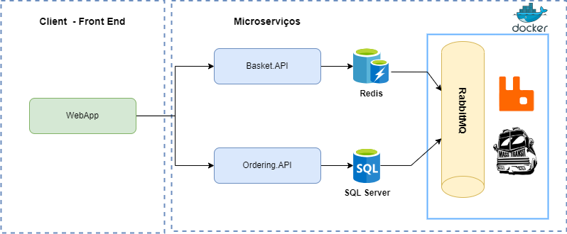
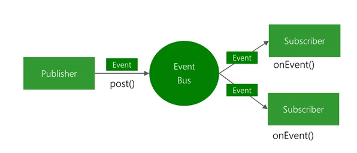

# Techchallenge04 - Design de um Producer e Consumer utilziando RabbitMq para um E-commerce

Tech Challenge 04 engloba o desenvolvimento de uma aplicação que implementa um producer que envia os dados para um broker (RABBITMQ) e um consumer que recebe esses dados e trata-os.
Para realização do desafio proposto, foi realizada a criação de dois microserviços Basket e Ordering connectados por um broker RabbitMQ para produzir e consumir eventos gerados entre os microserviços.
Abaixo é possível verificar a arquitetura da Applicação por completa:


Foi criada uma biblioteca chamada EventBus.Messages que prove a comunicação entre o microsserviço de Basket e Ordering.

A Implementação do Barramento de dados com RabbitMQ e Masstransit, na qual, os microserviços publicam eventos e recebem eventos é exibido na imagem abaixo:



A API Orderring foi feita utilizando EntityFramework com SQL Server aplicando arquitetura limpa e CQRS com mediator.

Funciomento:

1.  Usuário adiciona os itens no carrinho através do endpoid POST Basket e são guardados no banco de dados redis.
2.  Após adicionar todos os itens no carrinho, é enviado o comando de BasketCheckout atráves do end point `[POST] api/v1/Basket/Checkout` pela aplicação do cliente.
3.  O microserviço Basket recebe a informação e começa a tratar o dados como remover os itens da cesta do redis e envia-lo para o broker.
4.  É feita a publicação do evento BaketCheckout para o RabbitMQ utilizando o MassTransit.
5.  Os microserviços subescritos para receber esse evento, no caso, o microserviço Ordering, irá receber e consumir o evento para criar o pedido e salvar no banco de dados SQL.

## Aplicação

O Projeto não possue front end, sendo assim, foi disponibilizado somente os endpoint para comunicação através de alguma ferramente de mercado que faça requisições HTTP ou swagger.
Para fazer o o comando de checkout é necessário antes ter adicionado pelo menos um item na cesta.

### URL de Acesso

Para testar a API é necessário criart todo infraestrutura antes. As URLS de acesso será da seguiinte forma:

1. URL `https://localhost:<PORT>/swagger/index.html` para acesso via Swagger.

### Métodos

Requisições para a API devem seguir os padrões:
| Método | Descrição |
|---|---|
| `GET` | Retorna informações de um ou mais registros. |
| `POST` | Utilizado para criar um novo registro. |
| `PUT` | Atualiza dados de um registro ou altera sua situação. |
| `DELETE` | Remove um registro do sistema. |

### Respostas

| Código | Descrição                                                          |
| ------ | ------------------------------------------------------------------ |
| `200`  | Requisição executada com sucesso (success).                        |
| `400`  | Erros de validação ou os campos informados não existem no sistema. |
| `401`  | Usuário não autorizado.                                            |
| `500`  | EndPoint não encontrado,                                           |

### Controller [/Basket]

Reponsável pelo controle da cesta do E-commerce. Nele é onde será feito o controle da cesta do usuário como adição de itens e checkout.
OBS:Para fazer o o comando de checkoput é necessário antes ter adicionado pelo menos um item na cesta.

| Método   | URL                         | Descrição                  | Parâmetros [JSON]     | Retorno        |
| -------- | --------------------------- | -------------------------- | --------------------- | -------------- |
| `POST`   | [api/v1/Basket]             | Adiciona item na cesta     | Lista de itens        | -------------- |
| `GET`    | [api/v1/Basket/{username}]  | Retorna os itens da cesta  | --------------------- | Lista de itens |
| `DELETE` | [api/v1/Basket/{username}`] | Deleta os itens da cesta.  | --------------------- | -------------- |
| `POST`   | [api/v1/Basket/Checkout]    | checkout do itens da cesta | basket checkout itens | -------------- |

### Controller [/Order]

Responsável pelo controle de artigos da API. Esse endpoint deve ser utilizado somente depois de estar autenticado e e deve ser passado no header da requisição o token do usuário.
OBS: Deve ser criado antes ao menos um autor e uma categoria para ser passada de parámetro.

| Método   | URL                       | Descrição                            | Parâmetros [JSON]                 | Retorno          |
| -------- | ------------------------- | ------------------------------------ | --------------------------------- | ---------------- |
| `POST`   | [api/v1/Order]            | Recebe o cadastro de uma novo Order. | BasketCheckout item               | ---------------- |
| `GET`    | [api/v1/Order/{username}] | Retorna todos orders de um usuário.  | --------------------------------- | Lista de orders  |
| `DELETE` | [api/v1/Order/{id}]       | Deleta um order.                     | --------------------------------- | ---------------- |
| `PUT`    | [api/v1/Order]            | Atualiza um Order.                   | UpdateOrderCommand                | ---------------- |

## Pré-Requisitos

1. Visual Studio 2022
2. .NET 8
3. Docker Desktop

### Configuração da Infraestrutura do docker

1. Configurar o SQL Server <br />
   Executar o seguinte comando no prompt de comando:

```
  COLOCAR O COMANDO AQUI
```

Alterar os parâmetros do appsettings em `Ordering.Api/appsetting.json`

```
  "ConnectionStrings": {
    "OrderingConnectionString": "<SQL_CONNECTION_STRING>"
  },
```

2. Configurar o Redis <br/>
   Executar o seguinte comando no prompt de comando:

```
COLOCAR O COMANDO AQUI
```

Alterar os parâmetros do appsettings em `Basket.Api/appsetting.json`

```
"CacheSettings": {
    "ConnectionString": "<REDIS_CONNECTION_STRING>
  }
```

3. Configurar o MassTransit <br/>
   Executar o seguinte comando no prompt de comando:

```
COLOCAR O COMANDO AQUI
```

Alterar os parâmetros do appsettings em `Basket.Api/appsetting.json` e `Ordering.Api/appsetting.json`

```
"EventBusSettings": {
    "Server": "<MASSTRANSIT_HOSTNAME>",
    "User": "<MASSTRANSIT_USER>",
    "Password": "<MASSTRANSIT_PASSWORD>"
  },
```
